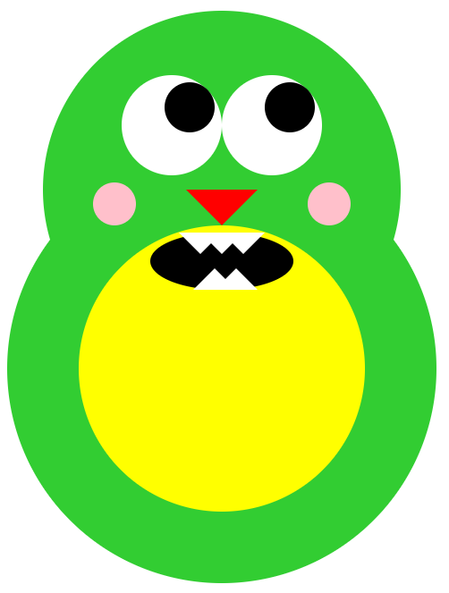

#Read Me

##Look Around Monster

This monster is a fun little guy designed to go at the bottom of your webpage (or anywhere, with a little bit of tweaking). He looks back and forth every second. My goal here was to build a monster using only CSS.

This is part of a project to create fun website "widgets" that can be easily implemented.

###Contributor

<a href="mailto:akb.miceli@gmail.com">Alicia Miceli